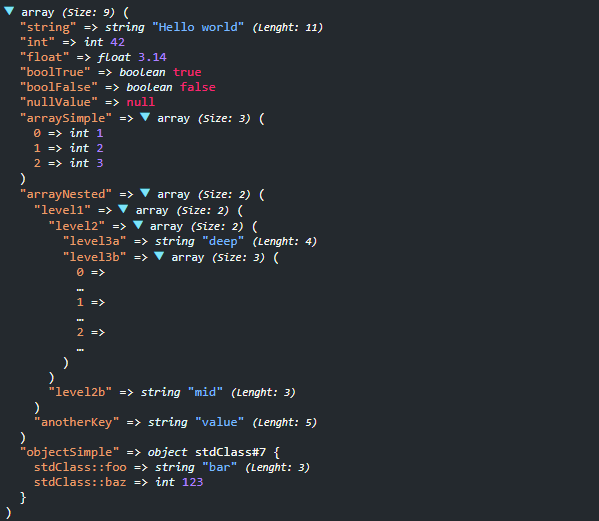

# PHP VarDumper

A lightweight and versatile PHP library for debugging and inspecting variables with customizable output formats.

## Installation

You can install this library via [Composer](https://getcomposer.org/). Ensure your project meets the minimum PHP version requirement of 7.4.

```bash
composer require phpdevcommunity/php-vardumper
```

## Requirements

- PHP version 7.4 or higher

## Usage

The library provides two main functions for debugging: `dump()` and `dd()`. These functions allow you to inspect variables in a readable format, with support for both CLI and HTML output.

### `dump()` Function

The `dump()` function outputs the variable(s) passed to it without terminating the script. This is useful for inspecting variables during the execution of your code.

```php
<?php

require 'vendor/autoload.php';

$data = [
    'name' => 'John Doe',
    'age' => 30,
    'email' => 'john.doe@example.com'
];

dump($data);
```

### `dd()` Function

The `dd()` function (short for "dump and die") outputs the variable(s) passed to it and then terminates the script. This is useful for debugging and inspecting variables at a specific point in your code.

```php
<?php

require 'vendor/autoload.php';

$data = [
    'name' => 'John Doe',
    'age' => 30,
    'email' => 'john.doe@example.com'
];

dd($data);
```

### Output Formats

The library automatically detects the environment (CLI or web) and formats the output accordingly. You can also manually specify the output format if needed.

#### CLI Output

When running in a CLI environment, the output is formatted for readability in the terminal.

```php
<?php

require 'vendor/autoload.php';

$data = [
    'name' => 'John Doe',
    'age' => 30,
    'email' => 'john.doe@example.com'
];

dump($data);
```

**CLI Output Example:**

```
array(3) [
  [name] => (string) "John Doe"
  [age] => (int) 30
  [email] => (string) "john.doe@example.com"
]
```

#### HTML Output

When running in a web environment, the output is formatted with HTML for better readability in the browser.

```php
<?php

require 'vendor/autoload.php';

$data = [
    'name' => 'John Doe',
    'age' => 30,
    'email' => 'john.doe@example.com'
];

dump($data);
```

**HTML Output Example:**

```html
<div id="var_dump_7426e40db5b46be3c13051ff19d2eff0" class="__beautify-var-dumper">
    <span class="type caret caret-down" data-target="#target_0fa6bec56ef91af4269ff3ac1ec702e4">array</span> 
    <small><i>(Size: 3)</i></small> (
    <br>
    <div class="nested active" id="target_0fa6bec56ef91af4269ff3ac1ec702e4">
        <span class="key">name</span> =&gt; 
        <span class="string">
            <span class="type">string</span> 'John Doe'
        </span> 
        <small><i>(Lenght: 8)</i></small>
        <br>
        <span class="key">age</span> =&gt; 
        <span class="number">
            <span class="type">int</span> 30
        </span>
        <br>
        <span class="key">email</span> =&gt; 
        <span class="string">
            <span class="type">string</span> 'john.doe@example.com'
        </span> 
        <small><i>(Lenght: 20)</i></small>
        <br>)
    </div>
</div>
```

### Custom Output

You can also customize the output by passing a custom `OutputInterface` implementation to the `VarDumper` constructor.

```php
<?php

require 'vendor/autoload.php';

use PhpDevCommunity\Debug\VarDumper;
use PhpDevCommunity\Debug\Output\OutputInterface;

class CustomOutput implements OutputInterface
{
    public function print($data): void
    {
        // Custom output logic here
        echo "Custom Output: " . print_r($data, true);
    }
}

$data = [
    'name' => 'John Doe',
    'age' => 30,
    'email' => 'john.doe@example.com'
];

$varDumper = new VarDumper(new CustomOutput());
$varDumper->dump($data);
```

## Screenshots


### CLI Mode


### HTML Mode



## License

This library is open-source software licensed under the MIT license. See the [LICENSE](LICENSE) file for more information.
